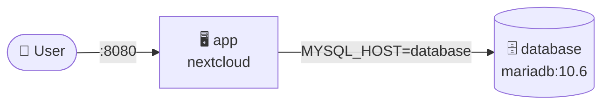
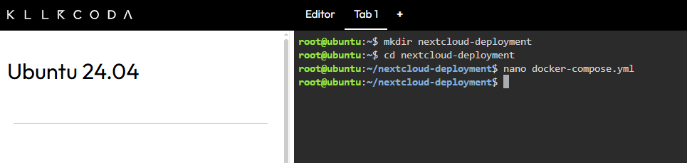
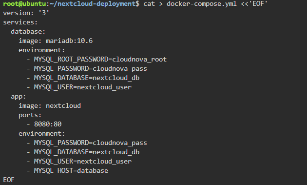
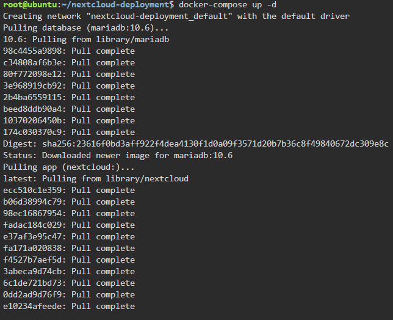
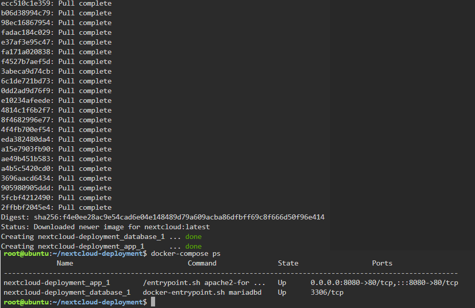
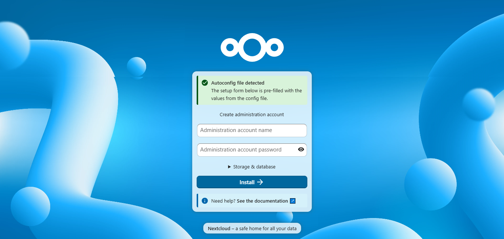
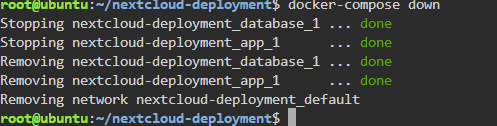

<div align="center">

# ☁️ Laboratory 06 – The Cloud Deployment Engineer

**CCM101 – Cloud Computing** · Midterm Laboratory Exam · Mission 6


**Student:** Prince Edrian Casem

</div>

---

## 🎯 Mission Overview

CloudNova Technologies needed a proof-of-concept private cloud storage system for a university that wants to stop paying for Google Drive. I deployed a **two-tier stack**, a **Nextcloud** web application backed by a **MariaDB** database, on a KillerCoda playground. Using Docker Compose, the whole infrastructure was defined in one YAML file and deployed with a single command.



## ✅ Objectives

- [x] Explain the concept of a multi-tier application architecture.
- [x] Understand the purpose and structure of a `docker-compose.yml` file.
- [x] Use `nano` to create configuration files.
- [x] Deploy a multi-container application (Nextcloud + Database) using Docker Compose.
- [x] Document deployment procedures and IaC principles using Markdown.

## 💻 Commands Executed

| Command | What it did |
|---|---|
| `mkdir nextcloud-deployment` | Created a new folder for the project |
| `cd nextcloud-deployment` | Moved inside the project folder |
| `nano docker-compose.yml` | Opened the nano editor to write the Compose file |
| `docker-compose up -d` | Pulled the images and started both containers in the background |
| `docker-compose ps` | Listed the stack's containers to confirm they were running |
| `docker-compose down` | Stopped and removed the containers and network |

```bash
mkdir nextcloud-deployment
cd nextcloud-deployment
nano docker-compose.yml
docker-compose up -d
docker-compose ps
docker-compose down
```

## 📸 Screenshots

| Checkpoint | Evidence |
|---|---|
| Project folder + opening nano |  |
| Compose file (`docker-compose.yml`) |  |
| `docker-compose up -d` (pulling images) |  |
| Deployment + running containers |  |
| Nextcloud setup page |  |
| Teardown |  |

## 🧠 Skills Learned

- Writing a multi-container stack in **YAML** and understanding why indentation matters.
- Deploying and managing a whole application with **Docker Compose** (`up -d`, `ps`, `down`).
- Connecting containers through service names (`MYSQL_HOST=database`) on a shared Compose network.
- Passing configuration with **environment variables** and mapping ports (`8080:80`).
- Accessing a running service through the KillerCoda **Traffic / Ports** tab.
- Explaining **two-tier architecture** and **Infrastructure as Code** principles in Markdown.

## 📚 Documentation

| Document | Description |
|---|---|
| [🏗️ Multi-Tier Architecture](multi-tier-architecture.md) | Two-tier design and why the tiers are separated |
| [🐳 Docker Compose Guide](docker-compose-guide.md) | Walkthrough of the YAML file and `docker run` vs Compose |
| [💭 Reflection](reflection.md) | Personal reflection on the mission |

## 🗂️ Repository Structure

```text
Laboratory-06-Cloud-Deployment-Engineer
├── README.md
├── multi-tier-architecture.md
├── docker-compose-guide.md
├── reflection.md
└── screenshots/
    ├── 01-project-setup.png
    ├── 02-compose-file.png
    ├── 03-compose-up-pulling.png
    ├── compose-deployment.png
    ├── nextcloud-web.png
    └── compose-teardown.png
```
