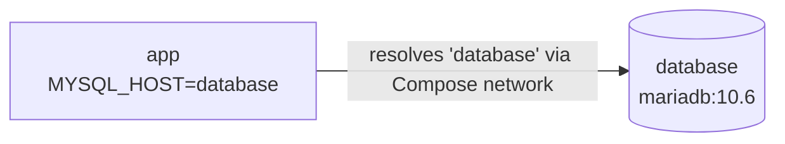

# 🐳 Docker Compose Guide

> A walkthrough of the Compose file used in this lab, written so another engineer can understand it.

---

## 📄 The Compose File Used

```yaml
version: '3'
services:
  database:
    image: mariadb:10.6
    environment:
      - MYSQL_ROOT_PASSWORD=cloudnova_root
      - MYSQL_PASSWORD=cloudnova_pass
      - MYSQL_DATABASE=nextcloud_db
      - MYSQL_USER=nextcloud_user
  app:
    image: nextcloud
    ports:
      - 8080:80
    environment:
      - MYSQL_PASSWORD=cloudnova_pass
      - MYSQL_DATABASE=nextcloud_db
      - MYSQL_USER=nextcloud_user
      - MYSQL_HOST=database
```

### 🔍 Quick breakdown

| Key | Meaning |
|---|---|
| `version: '3'` | Compose file format version |
| `services` | The list of containers that make up the stack |
| `image` | Which Docker image the container is created from |
| `ports` | Maps a host port to a container port (`8080` → `80`) |
| `environment` | Variables passed into the container at startup |

---

## 1️⃣ What does the `services:` block do?

The `services:` block **lists every container that belongs to the stack**. Each key directly under it is one service, and in this file there are two: `database` (MariaDB) and `app` (Nextcloud). Under each service, I define how that container should run, such as its image, ports, and environment variables. Compose reads this block and creates and starts all of them together.

---

## 2️⃣ How did the Nextcloud container find the database container?

Through the line **`MYSQL_HOST=database`** in the `app` service. The value `database` matches the **service name** of the MariaDB container in the same file. Compose automatically puts all services in the file on a **shared network** and registers each service name as a **hostname**, so Nextcloud can reach MariaDB simply by using the name `database`. There is no need to look up or hard-code an IP address.



---

## 3️⃣ `docker run` vs `docker-compose up -d`

| | `docker run` | `docker-compose up -d` |
|---|---|---|
| **Scope** | Starts **one** container | Starts the **whole stack** at once |
| **Configuration** | Long command with many flags | A readable **YAML file** |
| **Repeatability** | Must retype or remember the command | Same file gives the same result every time |
| **Networking** | Containers must be linked manually | Services share a network automatically |
| **IaC** | Not really, the setup lives in the command history | Yes, the file can be versioned in Git |

The `-d` flag means **detached mode**, so the containers run in the background and the terminal stays free to use.

In short, `docker run` is good for a quick single container, while `docker-compose up -d` is better for multi-container applications because the entire infrastructure is described as code and can be deployed with one command.
