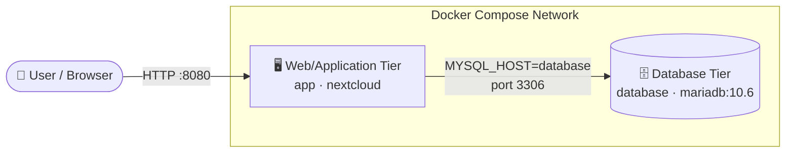

# 🏗️ Multi-Tier Architecture: Two-Tier Setup for Nextcloud

> **Project:** CloudNova private cloud storage proof-of-concept
> **Stack:** Nextcloud (web/app tier) + MariaDB (database tier)

---

## 📌 What is a Two-Tier Architecture?

A two-tier architecture splits an application into **two separate layers** that communicate with each other over a network. In this lab, the user-facing application is one layer and the data storage is the other, each running in its own container.

---

## 🖥️ The Web/Application Tier

| | |
|---|---|
| **Service name** | `app` |
| **Image** | `nextcloud` |
| **Port mapping** | `8080:80` (host → container) |

This tier is what the user actually interacts with. It **serves the user interface**, **handles HTTP requests** from the browser, and **runs the application logic** (logins, file uploads, sharing). It is the only tier exposed to the outside through port `8080`.

---

## 🗄️ The Database Tier

| | |
|---|---|
| **Service name** | `database` |
| **Image** | `mariadb:10.6` |
| **Port** | `3306` (internal only) |

This tier is responsible for **storing persistent data**: user accounts, credentials, and file metadata. The app tier never keeps this information itself. It asks the database whenever it needs it. Notice that port `3306` is not published to the host, so only containers inside the Compose network can reach it.

---

## ❓ Why Separate Them?

Keeping the web server and the database in two containers lets each one be **updated, restarted, or scaled on its own** without touching the other. It is also **more secure**, since the database is not exposed to the internet and only the app tier can reach it. Lastly, it follows the **"one container, one job"** rule, which makes troubleshooting much easier because a problem can be traced to a single, specific container.
